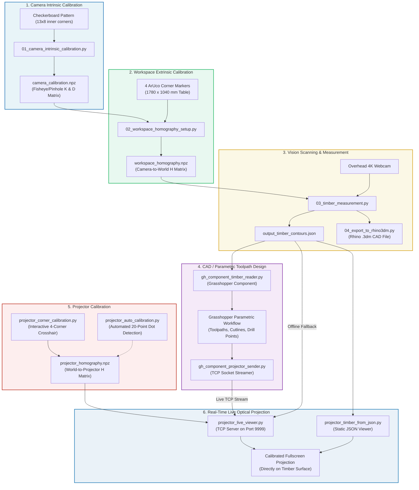

# eWoodX - Computer Vision & Projector-Guided Timber Processing System

**eWoodX** is an end-to-end computer vision and augmented reality projection framework designed for robotic and manual timber fabrication. It bridges the physical workspace, 2D/3D computer vision inspection, Rhino/Grasshopper parametric design, and real-time optical projection.

---

## 🏗️ System Architecture & Workflow



---

## 📐 Coordinate Systems & Calibration Principles

The system unifies three distinct 2D coordinate spaces using planar homographies and 3D optical parallax compensation:

```
[ Camera Frame ]                [ Table World Frame ]               [ Projector Frame ]
  (3840 x 2160 px)    Homography      (1780 x 1040 mm)     Homography    (1280 x 800 px)
Camera Pixels (u, v) ------------> Physical Table (X, Y) -------------> Projector Pixels (u, v)
                           H_cam_to_world                   H_world_to_proj
```

- **Table World Frame (mm):**
  - **Origin (0, 0):** Marker 1 (Bottom-Left).
  - **+X Axis (1780 mm):** Directed towards Marker 0 (Bottom-Right).
  - **+Y Axis (1040 mm):** Directed towards Marker 2 (Top-Left).
  - **(+X, +Y):** Marker 3 (Top-Right).
- **Projector Screen Placement:**
  - Placed seamlessly on the extended monitor via `PROJECTOR_SCREEN_ORIGIN_X` and `PROJECTOR_SCREEN_ORIGIN_Y`.
- **3D Parallax Compensation (Thickness $Z$):**
  - Compensates for the optical height shift when projecting onto thick timber slabs ($Z > 0\text{ mm}$) using projector lens mounting coordinates (`PROJECTOR_POS_X_MM`, `PROJECTOR_POS_Y_MM`, `PROJECTOR_HEIGHT_MM`).

---

## ⚙️ Centralized Configuration (`config.py`)

All hardware parameters, workspace dimensions, camera settings, and display geometries are defined in [`config.py`](config.py) as the **single source of truth**.

### Key Configuration Variables:

| Variable | Default Value | Description |
| :--- | :--- | :--- |
| `CAMERA_INDEX` | `1` | OpenCV camera device ID. |
| `IMAGE_WIDTH` / `IMAGE_HEIGHT` | `3840`, `2160` | Camera capture resolution. |
| `CALIBRATION_MODEL` | `"fisheye"` | Lens distortion model (`"fisheye"` or `"standard"`). |
| `TABLE_WIDTH_MM` / `TABLE_HEIGHT_MM` | `1780.0`, `1040.0` | Physical table dimensions in mm. |
| `PROJECTOR_WIDTH` / `PROJECTOR_HEIGHT` | `1280`, `800` | Native resolution of projector display. |
| `PROJECTOR_SCREEN_ORIGIN_X` | `2560` | Desktop X coordinate where projector monitor starts. |
| `PROJECTOR_SCREEN_ORIGIN_Y` | `0` | Desktop Y coordinate where projector monitor starts. |
| `PROJECTOR_HEIGHT_MM` | `2300.0` | Optical distance from projector lens to table surface (mm). |
| `PROJECTOR_POS_X_MM` / `PROJECTOR_POS_Y_MM` | `920.0`, `50.0` | Projector lens 3D offset relative to Table Origin. |

### Dynamic CLI Overrides:
Any production script supports runtime CLI overrides for display setup:
```bash
python projector_live_viewer.py --proj_x 1920 --proj_y 0 --proj_width 1920 --proj_height 1080
```

---

## 🚀 Step-by-Step Production Guide

### Prerequisites
1. Install Python 3.10+ (recommended: conda environment `ewoodx`).
2. Install dependencies:
```bash
pip install -r requirements.txt
```

---

### Step 1: Camera Intrinsic Lens Calibration
Calibrates the 4K camera lens to eliminate fisheye / barrel distortion.
```bash
python 01_camera_intrinsic_calibration.py
```
- Hold the printed checkerboard in the camera field of view across multiple angles.
- Press `Space` to capture frames (15–25 frames recommended).
- Press `C` to compute and save `calibration_data/camera_calibration.npz`.

---

### Step 2: Workspace Homography Setup
Maps camera pixel coordinates directly to real-world table millimeters using the 4 ArUco corner markers.
```bash
python 02_workspace_homography_setup.py
```
- Automatically detects ArUco markers `[1, 0, 2, 3]` at table corners.
- Calculates and saves `calibration_data/workspace_homography.npz`.

---

### Step 3: Timber Contour Scanning & Measurement
Detects raw wood slabs on the table, computes contour polygons, bounding boxes, defects, and corner coordinates.
```bash
python 03_timber_measurement.py
```
- Outputs real-world measurement contours to `sample_output/output_timber_contours.json`.
- Automatically executes `04_export_to_rhino3dm.py` to produce a 3D CAD `.3dm` model.

---

### Step 4: Projector Alignment Calibration
Aligns the projector pixels to the table's physical millimeter plane.

#### Method A: Direct 4-Corner Calibration (Recommended & Fast)
```bash
python projector_corner_calibration.py
```
- Projects interactive crosshairs for markers `1`, `0`, `2`, and `3`.
- Click near a crosshair or press `1`, `2`, `3`, `4` to select it.
- Fine-tune alignment with `W/A/S/D` or `Arrow Keys` until crosshairs match physical table markers.
- Press `S` to compute and save `calibration_data/projector_homography.npz`.

#### Method B: Fully Automatic Dot Calibration
```bash
python projector_auto_calibration.py
```
- Sequentially projects a grid of 20 bright dots across the table.
- Camera detects each dot and automatically computes the homography.

---

### Step 5: Real-Time Live Projector Viewer
Runs the live projection display and TCP Socket Server (Port `9999`) to stream geometry directly from Grasshopper.
```bash
python projector_live_viewer.py
```

#### Interactive Controls:
| Key | Action |
| :--- | :--- |
| `T` / `G` | Increase / Decrease timber thickness by $\pm 1.0\text{ mm}$ (3D parallax compensation). |
| `Shift + T` / `G` | Increase / Decrease timber thickness by $\pm 5.0\text{ mm}$. |
| `0` | Reset thickness to $0.0\text{ mm}$ (Table Surface plane). |
| `W` / `A` / `S` / `D` | Nudge real-world X/Y projection offsets in millimeter increments. |
| `+` / `-` | Increase / Decrease nudging step size ($0.5\text{ mm}$, $1.0\text{ mm}$, $5.0\text{ mm}$). |
| `C` | Toggle projection color palettes (High-contrast Green, Blueprint Blue, White, etc.). |
| `L` | Toggle label and dimension text overlays. |
| `R` | Reload calibration files and fallbacks from disk. |
| `Q` / `Esc` | Exit application. |

---

### Step 6: Rhino & Grasshopper Live Stream
1. Open Rhino and load `reader and sender.ghx`.
2. Use `gh_component_timber_reader.py` inside Grasshopper to automatically load the latest scanned timber contours.
3. Generate your toolpaths, pocketing lines, or cut layouts parametrically.
4. Stream the designed geometry back to `projector_live_viewer.py` via `gh_component_projector_sender.py` for direct projection onto the physical timber.

---

## 📁 Repository Structure

```
Webcam detection/
├── config.py                          # Centralized system configuration (Single Source of Truth)
├── requirements.txt                   # Project dependencies
├── README.md                          # Full system documentation & architecture guide
│
├── 01_camera_intrinsic_calibration.py  # Stage 1: Camera lens distortion calibration
├── 02_workspace_homography_setup.py   # Stage 2: ArUco-based workspace homography setup
├── 03_timber_measurement.py           # Stage 3: Timber scanning, segmentation & measurement
├── 04_export_to_rhino3dm.py           # Stage 3: Rhino 3DM CAD geometry exporter
│
├── projector_corner_calibration.py    # Stage 5: Manual 4-corner interactive projector calibration
├── projector_auto_calibration.py      # Stage 5: Automated 20-point dot projector calibration
├── projector_live_viewer.py           # Stage 6: High-performance TCP live projector viewer
├── projector_timber_from_json.py      # Stage 6: Standalone static JSON timber projection viewer
│
├── camera_utils.py                    # Reusable camera opening, undistortion & zoom utilities
├── gh_component_timber_reader.py      # Grasshopper Python script to import scanned timber
├── gh_component_projector_sender.py   # Grasshopper Python script to stream live geometry via TCP
├── reader and sender.ghx              # Grasshopper visual definition file
│
├── test_webcam_parameter_tuner.py     # Diagnostic tool for camera exposure/white balance
├── test_projector_sender_simulation.py# Unit test simulation for Grasshopper TCP socket stream
│
├── calibration_data/                  # Storage directory for .npz calibration matrices & reports
├── sample_output/                     # Scanned timber JSON and 3DM files
└── obsolete_prototypes/               # Archived prototypes and experimental scripts
```
